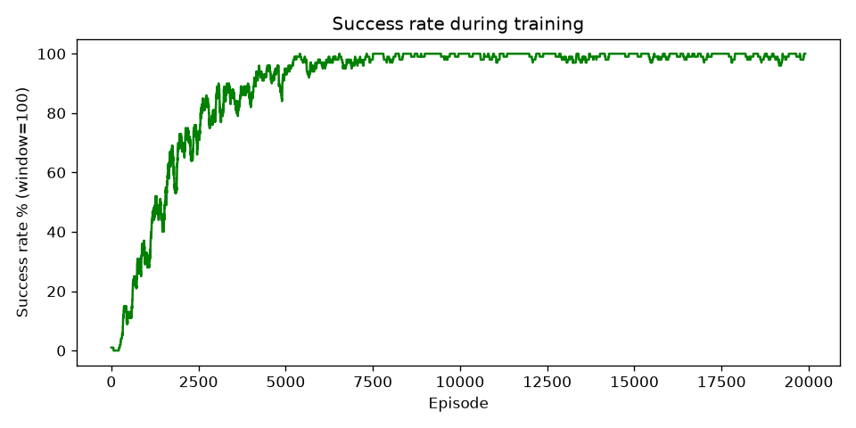
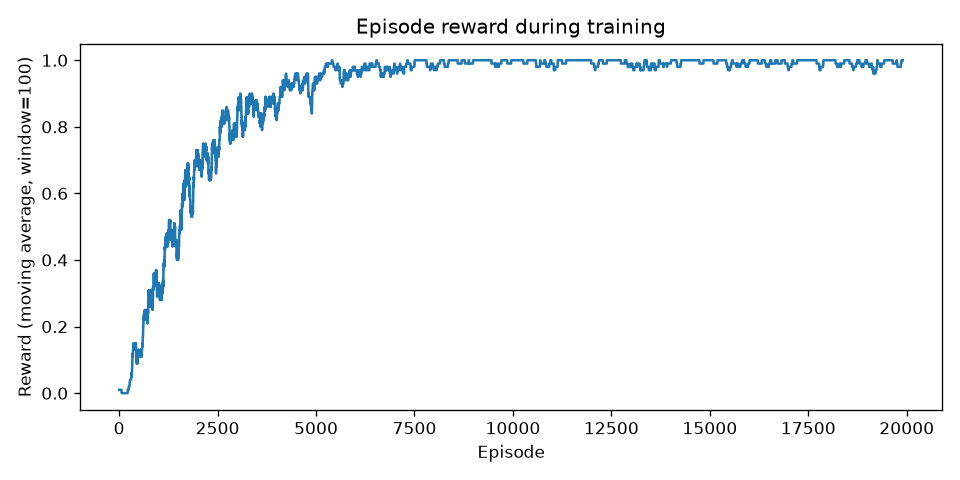
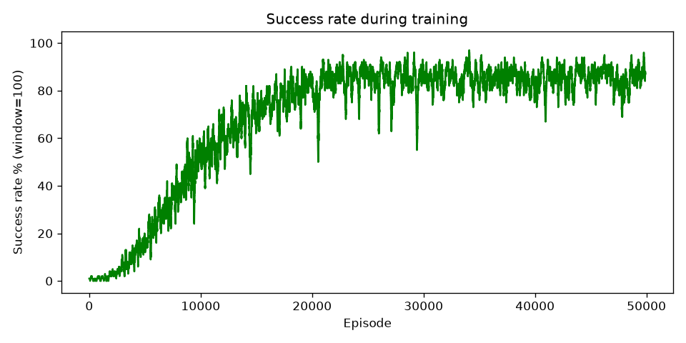
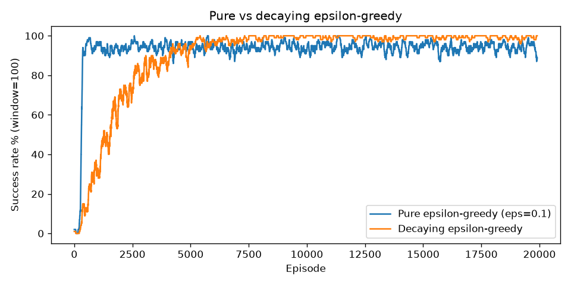

**Name:** Michael Kusi-Appiah

**GitHub Repository:** [https://github.com/mkusiappiah/frozen-lake-qlearning](https://github.com/mkusiappiah/frozen-lake-qlearning)

# 1. Introduction

Reinforcement Learning (RL) trains an agent to act inside an environment so
that it maximizes long term reward. The agent reads a state, chooses an
action, receives a reward, and lands in a new state. It repeats this loop and
improves its behavior from the reward signal alone, with no labeled data. The
formal model is a Markov Decision Process with states, actions, transition
probabilities, a reward function, and a discount factor.

Frozen Lake is a grid-world test problem. The agent starts at a Start cell and
must reach a Goal cell while avoiding Holes. This report describes a complete
solution to the 8x8 map with tabular Q-Learning. The environment, the agent,
the training loop, and the evaluation code are written from scratch in Python.
No reinforcement learning framework is used. The code depends only on NumPy and
Matplotlib.

# 2. Environment Design

The map is the 8x8 grid from the assignment, with one Start, one Goal, and ten
Holes. The class `FrozenLakeEnv` implements `reset`, `step`, `render`,
`get_state`, and `is_terminal`.

**State representation.** A state is one integer in the range 0 to 63. The
index maps to grid coordinates with `state = row * ncols + col`, and the
inverse uses integer division and remainder. The Start is state 0 at (0,0).
The Goal is state 63 at (7,7).

**Action representation.** Four discrete actions follow the required order:
0 Left, 1 Down, 2 Right, 3 Up. A move that would leave the grid keeps the
agent in place, which enforces the boundary.

**Reward structure.** The agent earns +1.0 for reaching the Goal and 0.0
everywhere else, including Holes. This sparse reward matches the classic
Frozen Lake definition. The discount factor carries that single reward back
along the path so cells nearer the Goal hold higher value.

**Stochastic option.** A flag `is_slippery` adds noise. The intended action
runs with probability $p$, and each perpendicular action runs with probability
$(1-p)/2$. Setting $p = 1/3$ reproduces the classic slippery dynamics.

# 3. Q-Learning Algorithm

Q-Learning is model-free, off-policy, and value-based. It learns an
action-value function $Q(s,a)$, the expected discounted return from action
$a$ in state $s$ followed by greedy behavior. The agent stores $Q$ in a 64 by
4 table that starts at zero.

After each transition $(s, a, r, s')$ the agent applies the update:

$$Q(s,a) \leftarrow Q(s,a) + \alpha \left[\, r + \gamma \max_{a'} Q(s',a') - Q(s,a) \,\right]$$

Here $\alpha$ is the learning rate, $\gamma$ is the discount factor, and the
bracket is the temporal difference error. When $s'$ is terminal, the future
term is zero and the target equals $r$. The method is off-policy because the
target uses $\max_{a'} Q(s',a')$, not the action that exploration picked.

The agent explores with an epsilon-greedy rule. With probability $\epsilon$ it
acts at random. Otherwise it takes $\arg\max_a Q(s,a)$. Epsilon decays once per
episode with $\epsilon \leftarrow \max(\epsilon_{min}, \epsilon \cdot d)$.
Early episodes explore. Late episodes exploit. Ties in the argmax break at
random to remove a fixed bias toward action 0.

# 4. Training Methodology

Each episode resets the environment, then loops: select an action, step the
environment, apply the Q-update, and continue until the episode ends or hits a
step cap of 200. The loop records episode reward, step count, a success flag,
and the epsilon value.

Deterministic run hyperparameters:

- Episodes: 20000
- Learning rate $\alpha$: 0.1
- Discount factor $\gamma$: 0.99
- Epsilon: 1.0 decaying to 0.01 at rate 0.9995 per episode
- Seed: 42

I selected $\gamma = 0.99$ so the goal reward survives across the 14 step path
($0.99^{13} \approx 0.88$). I selected a moderate $\alpha = 0.1$ for stable
updates. The decay schedule sends epsilon to its floor near episode 9000, which
leaves a long phase of near greedy refinement.

# 5. Experimental Results

On the deterministic map the agent solves the task. Training success rate over
20000 episodes is 89.88 percent, a figure pulled down by early random
exploration. Greedy evaluation over 100 episodes gives 100.00 percent success,
average reward 1.0000, zero failures.

The success-rate curve rises from near zero, crosses 90 percent near episode
5000, and settles at 100 percent once epsilon reaches its floor.

{width=85%}

The reward curve follows the same shape, since reward equals one only on
success.

{width=85%}

**Stochastic results (Bonus A).** With slippery dynamics ($p=1/3$) and 50000
episodes, greedy evaluation reaches 88.0 percent success over 1000 episodes.
Perfect success is impossible because random slips push the agent off its
intended path. The agent learns a cautious policy that avoids holes when a
slip is likely.

{width=85%}

**Exploration comparison (Bonus C).** Pure epsilon-greedy with fixed
$\epsilon = 0.1$ learns fast but its on-policy success rate plateaus near 93
percent, since it keeps acting at random 10 percent of the time. Decaying
epsilon-greedy starts slower, then settles near 100 percent on-policy as
exploration fades. Both reach 100 percent in greedy evaluation.

{width=85%}

# 6. Learned Policy

The greedy policy extracted from the Q-table:

```
 ↓  ↓  ↓  ↓  ↓  ↓  ↓  ↓
 →  →  →  →  →  ↓  ↓  ↓
 ↑  ↑  ↑  H  →  →  →  ↓
 ↑  ↑  ↑  H  ↑  →  →  ↓
 ↑  ↑  ↑  H  →  →  →  ↓
 ↑  H  H  →  ↑  ↑  H  ↓
 ←  H  ←  ←  H  ↑  H  ↓
 ←  ←  ←  H  ←  ←  ←  G
```

From the Start the route is: down to row 1, right to column 5, down to row 2,
right to column 7, then straight down column 7 to the Goal. This is a 14 step
path, the shortest safe route on this map. Arrows in cells far from this route
stay weak because a near greedy agent rarely visits them, so their values do
not converge. This does not lower performance from the Start.

# 7. Challenges Encountered

- **Sparse reward.** Only the Goal returns a reward. Before the agent first
  reaches it, every update sees zero, so no learning happens. High initial
  epsilon fixes this by forcing wide exploration until the agent stumbles onto
  the Goal.
- **Exploration schedule.** A decay that is too fast locks the agent into a
  weak policy. A decay that is too slow wastes episodes. I tuned the rate so
  epsilon reaches its floor at about 45 percent of training.
- **Tie breaking.** A zero table makes every action a tie at the start. Fixed
  argmax always picks action 0 and biases early behavior. Random tie breaking
  removes this.
- **Stochastic transitions.** Slipping raises variance and lowers the ceiling.
  The slippery run needed more episodes and a slower decay to stabilize.

# 8. Conclusion

Tabular Q-Learning solves the deterministic 8x8 Frozen Lake to optimality and
reaches a 100 percent greedy success rate. The discount factor carries the
sparse goal reward back along the path, and epsilon decay balances exploration
against exploitation. On the slippery map the same method reaches about 88
percent, the practical limit set by random slips. The comparison of
exploration strategies shows the core tradeoff: fixed exploration starts fast
but caps below optimal on-policy, while decaying exploration converges cleanly.
